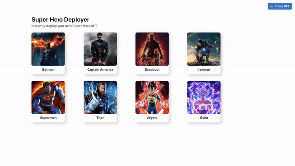
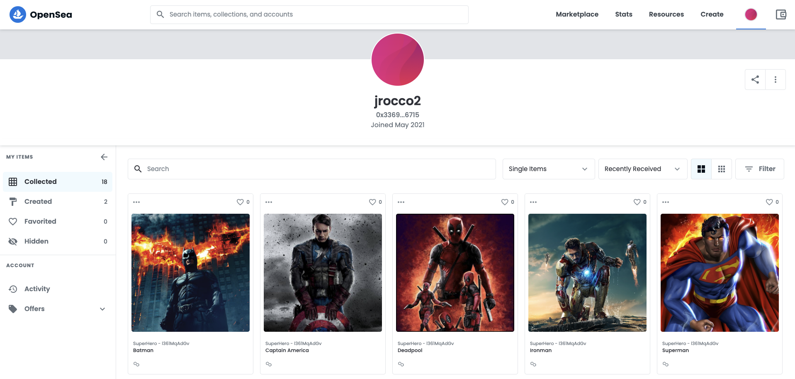

<h1 align="center">
  Super Hero NFT Deployer
</h1>

## Create NFT's 
Deploy NFTs directly to the Polygon Network.


## View NFT's 
When you create an NFT you can view it straight away in the UI.


## OpenSea compatible
The NFTs are also OpenSea compatible so when you create one it is automatically viewable in your personal profile.




## 🚀 Quick start (Frontend)

1.  **Install Packages.**

    Change to the right directory and install the npm packages

    ```shell
    cd frontend/gatsby
    npm install
    ```

2.  **Start the server.**

    ```shell
    npm run start
    ```

3.  **Open the browser.**

    Open the browser at http://localhost:8000

4.  **Setup Metamask**
    
    This website has minimal error handling so for this to work you need to have metamask installed in the browser and have the **Polygon Network** activated.


## 🚀 Quick start (Smart Contracts)

Coming Soon.